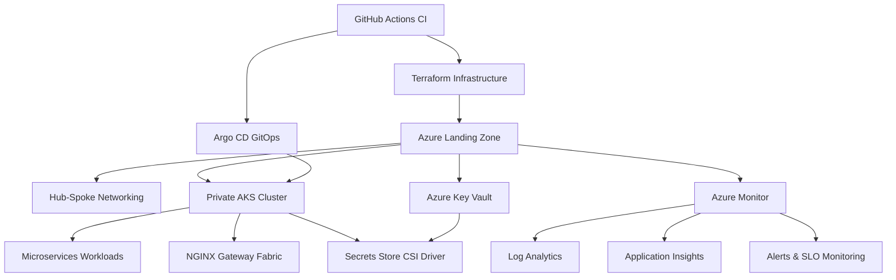

# Azure Cloud-Native DevOps Platform with Zero Trust

> Enterprise-grade Azure platform engineering project demonstrating secure cloud adoption, GitOps-driven delivery, Infrastructure as Code (Terraform), Kubernetes operations, observability, governance, and Zero Trust security principles.


# Overview

This project demonstrates how modern organizations can build a secure, scalable, automated, and production-ready cloud platform in Microsoft Azure using:

- Terraform Infrastructure as Code
- Azure Kubernetes Service (AKS)
- GitOps delivery workflows
- Enterprise Landing Zone governance
- Zero Trust architecture
- Observability & SRE practices
- FinOps & cost governance automation

The objective of this project is not just infrastructure provisioning — but full platform ownership across:

- Security
- Reliability
- Operations
- Governance
- Automation
- Observability
- Cost optimization

---

# Key Platform Capabilities

## Enterprise Landing Zone & Governance

Implemented a structured Azure Landing Zone architecture with:

- Management Groups
- RBAC governance
- Azure Policy enforcement
- Tagging standards
- Budget controls
- Environment isolation
- Policy-driven governance

---

## Zero Trust Security Architecture

Security was implemented as a foundational design principle using:

- Microsoft Entra ID (Azure AD)
- MFA & Conditional Access
- Privileged Identity Management (PIM)
- Managed Identity authentication
- Azure Key Vault
- Microsoft Defender for Cloud
- Private Endpoints
- Private AKS clusters

All workloads operate through secure private networking with tightly controlled administrative access.

---

## Cloud-Native Platform Engineering

Built a fully automated cloud-native platform using:

- Azure Kubernetes Service (AKS)
- Terraform modules
- GitHub Actions CI pipelines
- Argo CD GitOps deployments
- Azure Container Registry (ACR)
- Kustomize overlays
- Secrets Store CSI Driver

Infrastructure and application deployments are fully Git-driven with no manual production changes.

---

## Observability, Reliability & SRE

Implemented centralized observability and operational readiness using:

- Azure Monitor
- Application Insights
- Log Analytics
- OpenTelemetry instrumentation
- SLO-based monitoring & alerting
- Kubernetes health monitoring
- Operational dashboards
- Incident response workflows

### Reliability Goals

- Lead Time for Change < 1 day
- MTTR < 30 minutes
- 100% Terraform-managed infrastructure
- Zero critical unresolved security findings

---

## Cost Governance & FinOps

Integrated cost-aware engineering practices through:

- Azure Budgets
- Non-production auto-shutdown automation
- AKS node scaling optimization
- Policy-based governance controls
- Tag-driven cost allocation

This reduces unnecessary cloud spend while maintaining operational efficiency.

---

# Architecture Overview

## Core Principles

- Identity-first security
- Private-by-default networking
- Git as the single source of truth
- Automation over manual operations
- Observable systems
- Least-privilege access model
- Repeatable infrastructure deployments

---

# Platform Architecture



---

# Technology Stack

## Cloud & Infrastructure

- Microsoft Azure
- Terraform
- Azure Landing Zones
- Azure Policy
- Azure RBAC
- Azure Key Vault
- Azure Virtual Network (Hub-Spoke)

---

## Kubernetes & Platform Engineering

- Azure Kubernetes Service (AKS)
- Argo CD
- Helm
- Kustomize
- NGINX Gateway Fabric
- Secrets Store CSI Driver

---

## DevOps & Automation

- GitHub Actions
- GitOps workflows
- Terraform Remote State
- Actions Runner Controller (ARC)

---

## Security

- Entra ID (Azure AD)
- MFA
- Conditional Access
- Privileged Identity Management (PIM)
- Managed Identity
- Private Endpoints

---

## Observability

- Azure Monitor
- Log Analytics
- Application Insights
- OpenTelemetry

---

# Repository Structure

```bash
azure-cloud-native-platform/
│
├── envs/
│   ├── dev/
│   │   ├── phase1-foundation/
│   │   ├── phase2-core-infra/
│   │   ├── phase3-aks/
│   │   ├── phase4-gitops/
│   │   └── phase5-monitoring/
│   │
│   └── prod/
│       ├── phase1-foundation/
│       ├── phase2-core-infra/
│       ├── phase3-aks/
│       ├── phase4-gitops/
│       └── phase5-monitoring/
│
├── gitops/
│   ├── base/
│   └── overlays/
│       ├── dev/
│       └── prod/
│
├── terraform/
│   ├── modules/
│   ├── alerts.tf
│   ├── automation.tf
│   ├── monitoring.tf
│   ├── security.tf
│   ├── budget.tf
│   └── runbooks/
│
├── kubernetes/
│   ├── manifests/
│   ├── ingress/
│   └── addons/
│
├── scripts/
│
├── docs/
│
└── .github/
    └── workflows/
```

---

# Deployment Phases

| Phase | Objective | Deliverables |
|---|---|---|
| Phase 0 | Planning & Setup | Terraform backend, repo structure, environments |
| Phase 1 | Governance Foundation | Management Groups, RBAC, Policies, PIM |
| Phase 2 | Core Infrastructure | VNets, ACR, Key Vault, Log Analytics |
| Phase 3 | AKS Platform | Private AKS, node pools, workloads |
| Phase 4 | CI/CD & GitOps | GitHub Actions, Argo CD, overlays |
| Phase 5 | Observability & Security | Monitoring, alerts, Defender, budgets |
| Phase 6 | Validation & Operations | Dashboards, runbooks, incident simulations |

---

# AKS Access (Private Cluster)

This platform uses a private AKS cluster with controlled administrative access through Azure Bastion.

## Connect to Bastion Host

```bash
az network bastion ssh \
  --name bastion \
  --resource-group platform-hub-rg \
  --target-resource-id $(az vm show -g platform-spoke-rg -n jumpbox --query id -o tsv) \
  --auth-type ssh-key \
  --username azureuser \
  --ssh-key ~/.ssh/id_ed25519
```

## Login with Managed Identity

```bash
az login --identity
```

## Retrieve AKS Credentials

```bash
az aks get-credentials \
  -g platform-spoke-rg \
  -n 3tier-aks \
  --overwrite-existing
```

---

# Terraform Remote State

## Create Resource Group

```bash
az group create \
  --name tfstate-rg \
  --location eastus2
```

## Create Storage Account

```bash
az storage account create \
  --name 3tierstorageaccts \
  --resource-group tfstate-rg \
  --sku Standard_LRS \
  --kind StorageV2 \
  --https-only true \
  --allow-blob-public-access false
```

## Create State Container

```bash
az storage container create \
  --name tfstate \
  --account-name 3tierstorageaccts \
  --auth-mode login
```

---

# GitOps Workflow

The platform uses:

- GitHub Actions for CI pipelines
- Argo CD for GitOps continuous delivery
- Kustomize overlays for environment separation
- Actions Runner Controller (ARC) for self-hosted Kubernetes runners

Infrastructure and application deployments are entirely Git-driven.

---

# Security Model

This project follows Zero Trust principles:

- Identity-first authentication
- MFA enforcement
- PIM-enabled privileged access
- Private networking
- No public infrastructure exposure
- Policy-driven governance
- Managed identities instead of static credentials

---

# Success Metrics

- Lead Time for Change < 1 day
- MTTR < 30 minutes
- 100% Terraform-managed infrastructure
- Zero critical unresolved security findings
- Reduced non-production cloud waste

---

# Value Delivered

This project demonstrates:

- Enterprise-scale Azure architecture
- Secure cloud adoption using Zero Trust
- Platform engineering maturity
- GitOps & Infrastructure as Code best practices
- Cloud-native Kubernetes operations
- DevSecOps automation
- Observability & SRE-driven operations
- Cost-aware cloud governance

---

# Summary

Modern cloud engineering is no longer just about deploying resources.

It is about building secure, automated, observable, scalable, and operationally mature platforms that enable engineering teams to deliver faster with confidence.